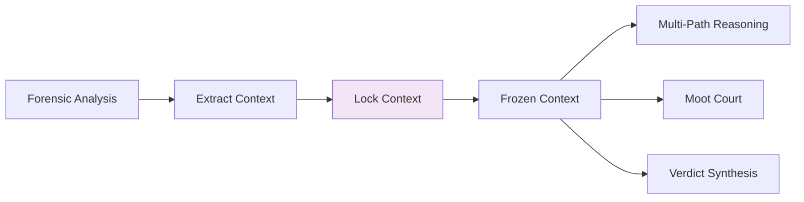

# Context Lock

**Step 2 of the JRF Protocol**

Context Lock freezes the interpretation context to prevent semantic drift during reasoning.

## Purpose

Ensure consistent interpretation throughout the 5-step protocol by locking the context after forensic analysis.

## Why Context Lock?

Traditional LLMs can reinterpret context mid-reasoning, leading to:
- ❌ Semantic drift
- ❌ Inconsistent conclusions
- ❌ Loss of traceability

JRF's Context Lock ensures:
- ✅ Immutable context
- ✅ Consistent interpretation
- ✅ Traceable reasoning

## Process



## Locked Elements

### 1. Domain

```python
{
    "domain": "medical",
    "locked_at": "2024-02-01T22:45:00Z"
}
```

### 2. Phase

```python
{
    "phase": "forensic",
    "context_id": "ctx-abc123"
}
```

### 3. Interpretation Rules

```python
{
    "interpretation": "literal",
    "scope": "diagnostic"
}
```

## Configuration

```python
from judicial_reasoning_framework import ContextConfig

config = ContextConfig(
    enable_lock=True,           # Enable context locking
    lock_duration=3600          # Lock duration in seconds
)
```

## Example

```python
from judicial_reasoning_framework import JudicialReasoningFramework

jrf = JudicialReasoningFramework()

# Input
input_text = "Patient has fever"

# Forensic analysis extracts context
analysis = jrf.forensic.analyze(input_text)
# Context: "medical diagnosis"

# Context Lock freezes interpretation
locked_context = jrf.context_lock.lock(
    domain="medical",
    phase="forensic"
)

# All subsequent steps use frozen context
# Multi-Path, Moot Court, Verdict all use same locked context
```

## Benefits

### Consistency

Same context throughout all 5 steps:
```
Forensic → Context Lock → Multi-Path → Moot Court → Verdict
           (frozen)       ↓            ↓            ↓
                       same context  same context  same context
```

### Traceability

Audit trail shows exact context used:
```json
{
    "context_id": "ctx-abc123",
    "locked_at": "2024-02-01T22:45:00Z",
    "domain": "medical",
    "phase": "forensic",
    "used_in": ["multi_path", "moot_court", "verdict"]
}
```

## Next Step

After context lock, proceed to [Multi-Path Reasoning](multi-path-reasoning.md) to explore 3 parallel hypotheses.

## API Reference

See [Python API](../api/python-api.md#contextconfig) for complete API documentation.
