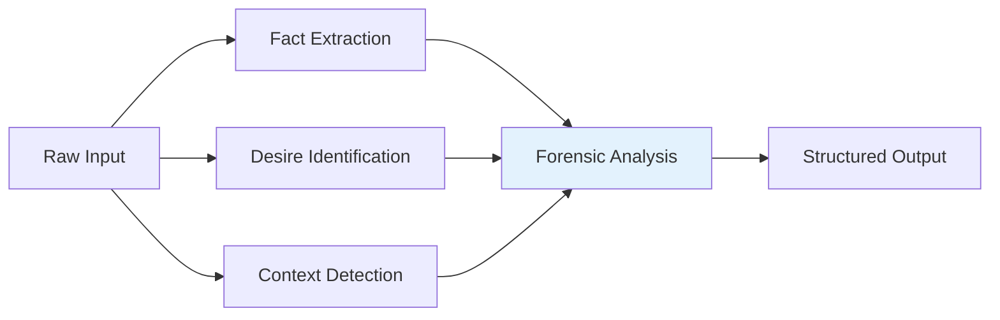

# Forensic Deconstruction

**Step 1 of the JRF Protocol**

Forensic Deconstruction is the first critical step where JRF extracts structured information from unstructured input.

## Purpose

Transform raw, ambiguous input into precise, structured facts, desires, and context.

## Process



## Components

### 1. Fact Extraction

Identifies objective, verifiable statements.

**Example**:
```
Input: "Patient has fever for 3 days"

Facts Extracted:
- Fever present
- Duration: 3 days
- Subject: Patient
```

### 2. Desire Identification

Identifies goals, objectives, or intentions.

**Example**:
```
Input: "Need to diagnose the cause"

Desires Identified:
- Diagnose underlying cause
- Determine treatment plan
```

### 3. Context Detection

Automatically detects domain and relevant context.

**Supported Domains**:
- Medical
- Legal
- Financial
- Technical
- General

## Configuration

```python
from judicial_reasoning_framework import ForensicConfig

config = ForensicConfig(
    min_facts=2,                    # Minimum facts required
    enable_domain_detection=True,   # Auto-detect domain
    domain_hint="medical"           # Optional domain hint
)
```

## Output Structure

```python
{
    "facts": [
        "fever 38.5°C",
        "dry cough",
        "duration 3 days"
    ],
    "desires": [
        "diagnose cause of symptoms"
    ],
    "context": "medical diagnosis",
    "detected_domain": "medical",
    "confidence": 0.95
}
```

## Best Practices

### ✅ Good Input

```python
# Specific, detailed
input_text = """
Patient: 45M
Symptoms: Fever 38.5°C, dry cough
Duration: 3 days
History: No chronic conditions
"""
```

### ❌ Poor Input

```python
# Vague, minimal
input_text = "Patient sick"
```

## Next Step

After forensic deconstruction, proceed to [Context Lock](context-lock.md) to freeze the interpretation.

## API Reference

See [Python API](../api/python-api.md#forensicconfig) for complete API documentation.
