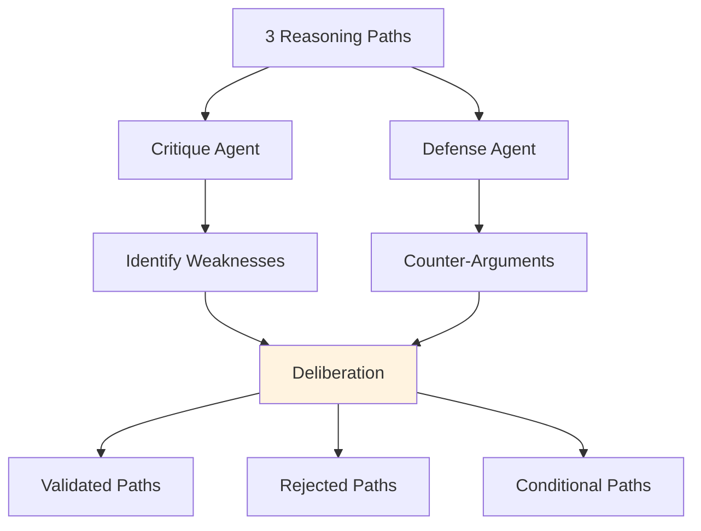

# Moot Court

**Step 4 of the JRF Protocol**

Moot Court provides adversarial deliberation to test and validate the 3 reasoning paths.

## Purpose

Challenge hypotheses through critique and defense to identify the most solid reasoning path.

## Process



## Deliberation Roles

### Critique Agent

**Role**: Identify weaknesses and challenge assumptions

**Responsibilities**:
- Find logical gaps
- Challenge evidence
- Question assumptions
- Assign severity scores

**Example**:
```python
{
    "target": "Literal Path",
    "severity": 0.7,
    "content": "Insufficient data for specific diagnosis",
    "evidence": "Only 3 symptoms provided"
}
```

### Defense Agent

**Role**: Counter critiques and strengthen arguments

**Responsibilities**:
- Provide counter-evidence
- Clarify reasoning
- Strengthen weak points
- Justify conclusions

**Example**:
```python
{
    "response_to": "critique-001",
    "defense": "Symptom pattern + exposure history support viral etiology",
    "evidence": "Epidemiological context"
}
```

## Validation Status

Each path receives one of three statuses:

### ✅ Validated

Path passes deliberation with strong evidence.

```python
{
    "path_type": "Intentional",
    "status": "Validated",
    "solidity_score": 0.82,
    "strengths": ["Clear context", "Specific symptoms"],
    "weaknesses": ["Limited history"]
}
```

### ❌ Rejected

Path fails deliberation due to critical flaws.

```python
{
    "path_type": "Literal",
    "status": "Rejected",
    "solidity_score": 0.45,
    "weaknesses": ["Insufficient data", "Logical gaps"]
}
```

### ⚠️ Conditional

Path valid under specific conditions.

```python
{
    "path_type": "Procedural",
    "status": "Conditional",
    "solidity_score": 0.68,
    "conditions": ["Requires additional testing"]
}
```

## Solidity Score

Each path receives a solidity score (0.0 - 1.0):

**Calculation**:
```
solidity = base_score + strengths_bonus - critiques_penalty
```

**Factors**:
- Evidence quality
- Logical consistency
- Domain appropriateness
- Critique severity

## Configuration

```python
from judicial_reasoning_framework import MootCourtConfig

config = MootCourtConfig(
    min_solidity=0.6,           # Minimum solidity to validate
    max_critiques=5,            # Maximum critiques per path
    severity_threshold=0.8      # Reject if critique severity > threshold
)
```

## Example

```python
from judicial_reasoning_framework import JudicialReasoningFramework

jrf = JudicialReasoningFramework()

verdict = jrf.run_protocol("Patient has fever for 3 days")

# Access deliberation results
for path in verdict.metadata.validated_paths:
    print(f"Path: {path.path_type}")
    print(f"Status: {path.status}")
    print(f"Solidity: {path.solidity_score:.0%}")
    print(f"Strengths: {path.strengths}")
    print(f"Weaknesses: {path.weaknesses}")
```

## Benefits

### Adversarial Testing

Unlike traditional LLMs that provide single answers, JRF tests hypotheses adversarially:

```
Traditional LLM:  Input → Answer (no challenge)

JRF Moot Court:   Path 1 → Critique → Defense → Validated/Rejected
                  Path 2 → Critique → Defense → Validated/Rejected
                  Path 3 → Critique → Defense → Validated/Rejected
```

### Robustness

Paths that survive critique are more robust.

### Transparency

Full audit trail of critiques and defenses.

## Next Step

After moot court, proceed to [Verdict Synthesis](verdict-synthesis.md) for the final decision.

## API Reference

See [Python API](../api/python-api.md#mootcourtconfig) for complete API documentation.
