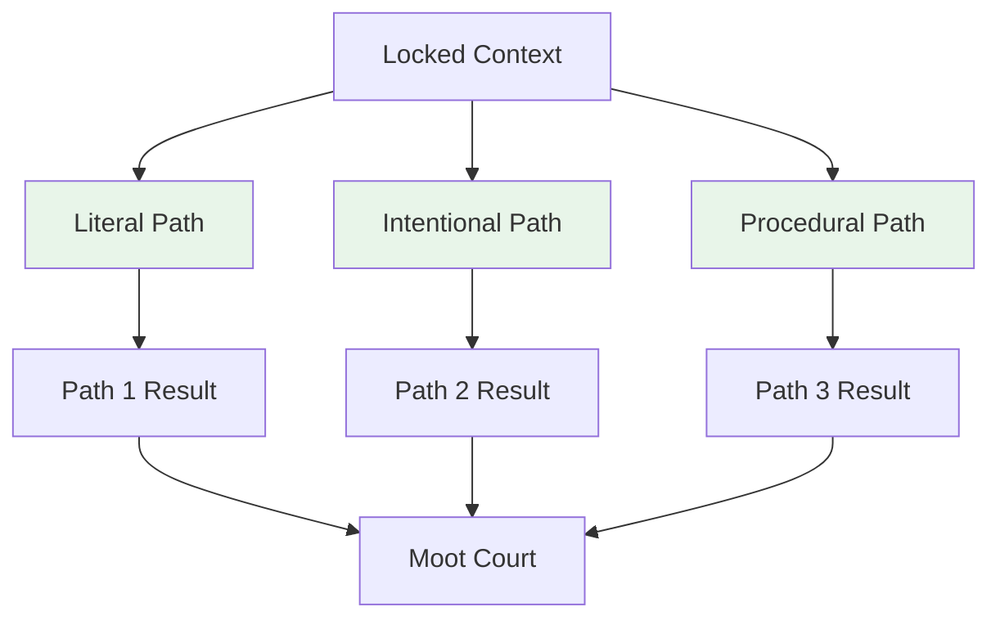

# Multi-Path Reasoning

**Step 3 of the JRF Protocol**

Multi-Path Reasoning explores 3 parallel hypotheses to ensure comprehensive analysis.

## Purpose

Generate multiple perspectives on the same input to avoid single-path bias.

## The 3 Paths

### 1. Literal Path

**Direct interpretation** - Analyzes facts as explicitly stated.

```python
Input: "Patient has fever for 3 days"

Literal Path:
- Fact: Fever present
- Fact: Duration 3 days
- Conclusion: Respiratory symptoms present
```

### 2. Intentional Path

**Goal-oriented** - Focuses on underlying objectives and intent.

```python
Input: "Patient has fever for 3 days"

Intentional Path:
- Goal: Diagnose cause
- Intent: Identify treatment
- Conclusion: Viral infection likely
```

### 3. Procedural Path

**Step-by-step** - Sequential, methodical reasoning.

```python
Input: "Patient has fever for 3 days"

Procedural Path:
Step 1: Assess severity
Step 2: Rule out emergencies
Step 3: Consider differential diagnosis
Conclusion: Systematic workup needed
```

## Process



## Configuration

```python
from judicial_reasoning_framework import MultiPathConfig

config = MultiPathConfig(
    enable_all_paths=True,      # Generate all 3 paths
    min_confidence=0.6,         # Minimum confidence threshold
    parallel_execution=True     # Execute paths in parallel
)
```

## Example

```python
from judicial_reasoning_framework import JudicialReasoningFramework

jrf = JudicialReasoningFramework()

# Run protocol
verdict = jrf.run_protocol("Patient has fever for 3 days")

# Primary path selected
print(verdict.primary_path)  # PathType.Intentional

# Secondary paths considered
print(verdict.secondary_paths)  # [PathType.Literal, PathType.Procedural]
```

## Path Selection

The **Moot Court** step evaluates all 3 paths and selects the most solid one as primary.

**Selection Criteria**:
- Solidity score (0.0 - 1.0)
- Number of strengths vs weaknesses
- Critique severity
- Domain appropriateness

## Benefits

### Comprehensive Analysis

```
Single Path:  A → B → C (one perspective)

Multi-Path:   A → B₁ → C₁ (literal)
              A → B₂ → C₂ (intentional)
              A → B₃ → C₃ (procedural)
```

### Bias Reduction

By exploring 3 perspectives, JRF reduces single-path bias.

### Robustness

If one path fails, others provide alternatives.

## Next Step

After multi-path reasoning, proceed to [Moot Court](moot-court.md) for adversarial deliberation.

## API Reference

See [Python API](../api/python-api.md#multipathconfig) for complete API documentation.
