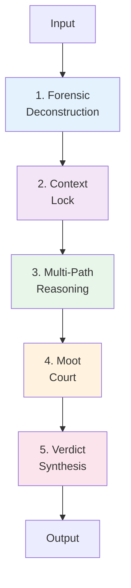
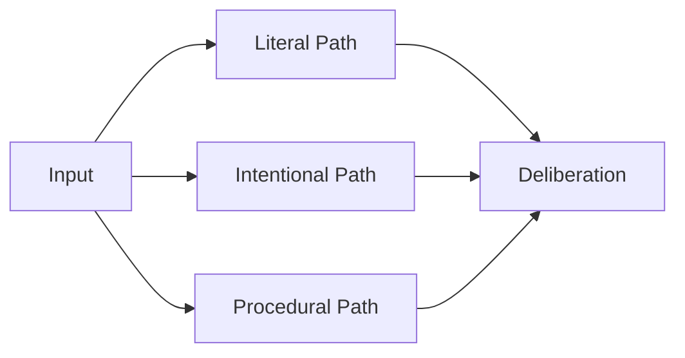

# Core Concepts Overview

JRF implements a **5-step judicial protocol** that transforms unstructured input into rigorous, justified decisions.

## The Judicial Protocol



## 1. Forensic Deconstruction

**Purpose**: Extract facts, desires, and context from raw input

**Input**: Unstructured text
**Output**: Structured analysis

```python
{
    "facts": ["fever 38.5°C", "dry cough", "3 days duration"],
    "desires": ["diagnose cause"],
    "context": "medical diagnosis",
    "detected_domain": "medical"
}
```

**Key Features**:
- Automatic domain detection
- Fact extraction
- Goal identification
- Context analysis

[Learn more →](forensic-deconstruction.md)

---

## 2. Context Lock

**Purpose**: Freeze interpretation context to prevent semantic drift

**Input**: Forensic analysis
**Output**: Locked context

```python
{
    "domain": "medical",
    "phase": "forensic",
    "locked_at": "2024-02-01T22:45:00Z"
}
```

**Key Features**:
- Immutable context
- Prevents reinterpretation
- Ensures consistency

[Learn more →](context-lock.md)

---

## 3. Multi-Path Reasoning

**Purpose**: Explore 3 parallel hypotheses

**Input**: Locked context
**Output**: 3 reasoning paths

### Path Types

**Literal** (Direct interpretation)
- Analyzes facts as stated
- No inference beyond explicit information

**Intentional** (Goal-oriented)
- Focuses on underlying objectives
- Infers purpose and intent

**Procedural** (Step-by-step)
- Sequential reasoning
- Methodical progression



[Learn more →](multi-path-reasoning.md)

---

## 4. Moot Court

**Purpose**: Adversarial deliberation to test hypotheses

**Input**: 3 reasoning paths
**Output**: Validated paths with critiques

### Deliberation Process

1. **Critique** - Identify weaknesses
2. **Defense** - Counter-arguments
3. **Validation** - Accept/Reject/Conditional

```python
{
    "validated_paths": [
        {
            "path_type": "Intentional",
            "status": "Validated",
            "solidity_score": 0.82,
            "strengths": ["Clear context", "Specific symptoms"],
            "weaknesses": ["Limited history"]
        }
    ],
    "critiques": [
        {
            "target": "Literal",
            "severity": 0.6,
            "content": "Insufficient data"
        }
    ]
}
```

[Learn more →](moot-court.md)

---

## 5. Verdict Synthesis

**Purpose**: Generate final decision with justification

**Input**: Validated paths + critiques
**Output**: Sovereign verdict

```python
{
    "conclusion": "Diagnosis: Viral respiratory infection",
    "certainty": 0.82,
    "primary_path": "Intentional",
    "justification": "Based on symptom pattern...",
    "recommendations": ["Further testing recommended"]
}
```

**Key Features**:
- Certainty score (0.0 - 1.0)
- Full justification
- Recommendations
- Audit trail

[Learn more →](verdict-synthesis.md)

---

## Why This Protocol?

### Traditional LLMs

```
Input → [Black Box] → Output
```

**Problems**:
- ❌ No traceability
- ❌ No justification
- ❌ Single path (no alternatives)
- ❌ No critique

### JRF Protocol

```
Input → Forensic → Context Lock → Multi-Path → Moot Court → Verdict
         ↓          ↓               ↓            ↓           ↓
       Facts     Frozen        3 Hypotheses   Critiques  Justified
                 Context                                  Decision
```

**Benefits**:
- ✅ Complete audit trail
- ✅ Full justification
- ✅ Multiple perspectives
- ✅ Built-in critique
- ✅ Certainty score

---

## Use Cases by Domain

### Legal
- **Forensic**: Extract contract clauses
- **Multi-Path**: Literal vs intentional interpretation
- **Moot Court**: Adversarial legal arguments
- **Verdict**: Legal opinion with precedents

### Medical
- **Forensic**: Extract symptoms and history
- **Multi-Path**: Differential diagnosis
- **Moot Court**: Challenge hypotheses
- **Verdict**: Diagnosis with confidence

### Financial
- **Forensic**: Extract transaction patterns
- **Multi-Path**: Risk scenarios
- **Moot Court**: Stress testing
- **Verdict**: Risk assessment

---

## Next Steps

Dive deeper into each step:

1. [Forensic Deconstruction](forensic-deconstruction.md)
2. [Context Lock](context-lock.md)
3. [Multi-Path Reasoning](multi-path-reasoning.md)
4. [Moot Court](moot-court.md)
5. [Verdict Synthesis](verdict-synthesis.md)

Or explore:

- [Beam Search Strategy](../guides/beam-search.md)
- [Examples](../examples/medical-diagnosis.md)
- [API Reference](../api/python-api.md)
