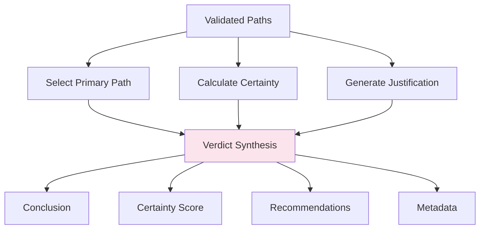

# Verdict Synthesis

**Step 5 of the JRF Protocol**

Verdict Synthesis generates the final, sovereign decision with full justification.

## Purpose

Synthesize validated paths into a single, justified verdict with certainty score and recommendations.

## Process



## Components

### 1. Primary Path Selection

Select the most solid path as primary:

```python
primary_path = max(validated_paths, key=lambda p: p.solidity_score)
```

**Criteria**:
- Highest solidity score
- Fewest critical weaknesses
- Most strengths
- Domain appropriateness

### 2. Certainty Calculation

Calculate overall certainty (0.0 - 1.0):

```python
certainty = avg_solidity + convergence_bonus - critique_penalty
```

**Factors**:
- Average solidity of validated paths
- Convergence bonus (multiple paths agree)
- Critique penalty (severe critiques)

### 3. Conclusion Generation

Generate human-readable conclusion:

```python
conclusion = f"""
Conclusion ({primary_path} approach): 
Based on {num_validated} validated path(s), 
{conclusion_text}
"""
```

### 4. Justification

Provide detailed justification:

```python
justification = f"""
The {primary_path} path was selected with {solidity:.0%} solidity.
Strengths: {strengths}
Analysis identified {num_facts} fact(s) and {num_desires} objective(s).
Deliberation considered {num_paths} path(s) and {num_critiques} critique(s).
"""
```

### 5. Recommendations

Generate actionable recommendations:

```python
recommendations = [
    "Convergence of multiple paths: Conclusion robust",
    "High certainty: Reliable decision",
    "Consider additional testing"
]
```

## Output Structure

```python
{
    "conclusion": "Diagnosis: Viral respiratory infection",
    "justification": "The Intentional path was selected...",
    "certainty": 0.82,
    "primary_path": "Intentional",
    "secondary_paths": ["Literal", "Procedural"],
    "recommendations": [
        "High certainty: Reliable decision",
        "Consider PCR testing"
    ],
    "metadata": {
        "rendered_at": "2024-02-01T23:00:00Z",
        "paths_considered": 3,
        "critiques_considered": 2,
        "quality_score": 0.85
    }
}
```

## Configuration

```python
from judicial_reasoning_framework import VerdictConfig

config = VerdictConfig(
    min_certainty=0.5,              # Minimum certainty required
    min_validated_paths=1,          # Minimum validated paths
    enable_recommendations=True     # Generate recommendations
)
```

## Example

```python
from judicial_reasoning_framework import JudicialReasoningFramework

jrf = JudicialReasoningFramework()

verdict = jrf.run_protocol("Patient has fever for 3 days")

# Access verdict
print(f"Conclusion: {verdict.conclusion}")
print(f"Certainty: {verdict.certainty:.0%}")
print(f"Primary path: {verdict.primary_path}")

# Justification
print(f"\nJustification:\n{verdict.justification}")

# Recommendations
print(f"\nRecommendations:")
for rec in verdict.recommendations:
    print(f"- {rec}")

# Metadata
print(f"\nQuality score: {verdict.metadata.quality_score:.0%}")
```

## Certainty Interpretation

| Certainty | Interpretation | Action |
|-----------|----------------|--------|
| 0.9 - 1.0 | Very High | Proceed with confidence |
| 0.7 - 0.9 | High | Reliable decision |
| 0.5 - 0.7 | Moderate | Consider additional analysis |
| 0.3 - 0.5 | Low | Seek expert review |
| 0.0 - 0.3 | Very Low | Insufficient evidence |

## Benefits

### Sovereign Decision

Final verdict is **sovereign** - not subject to reinterpretation:

```
Traditional LLM:  Answer (can be reinterpreted)

JRF Verdict:      Verdict (frozen, immutable, justified)
```

### Full Justification

Complete audit trail from input to verdict:

```
Input → Forensic → Context Lock → Multi-Path → Moot Court → Verdict
        ↓          ↓               ↓            ↓           ↓
      Facts     Frozen        3 Hypotheses  Critiques  Justified
                Context                                 Decision
```

### Actionable

Recommendations provide next steps.

## Quality Score

Overall quality score (0.0 - 1.0):

```python
quality = certainty + validated_bonus - critique_penalty
```

**Factors**:
- Certainty level
- Number of validated paths
- Severity of critiques

## Next Steps

After verdict synthesis, you have a complete, justified decision ready for use.

**Explore**:
- [Examples](../examples/medical-diagnosis.md) - See JRF in action
- [API Reference](../api/python-api.md) - Complete API docs
- [Integrations](../integrations/agent-lightning.md) - Integrate with other frameworks

## API Reference

See [Python API](../api/python-api.md#verdictconfig) for complete API documentation.
