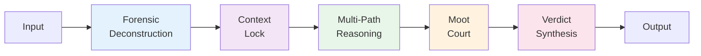

# Judicial Reasoning Framework (JRF)

<p align="center">
  <strong>Universal multi-agent reasoning based on judicial logic</strong>
  <br><br>
  <a href="https://pypi.org/project/judicial-reasoning-framework/">
    
  </a>
  
  
  
</p>

---


## What is JRF?

JRF transforms your LLM into a **rigorous judge**, applying a 5-step judicial protocol for traceable, defensible decisions.

Traditional LLMs give you answers. **JRF gives you verdicts with full justification.**

## Key Features

<div class="grid cards" markdown>

-   :material-magnify:{ .lg .middle } __Forensic Deconstruction__

    ---

    Extract facts, desires, and context from raw input with surgical precision

-   :material-lock:{ .lg .middle } __Context Lock__

    ---

    Freeze interpretation context to prevent semantic drift

-   :material-graph:{ .lg .middle } __Multi-Path Reasoning__

    ---

    Explore 3 parallel hypotheses: Literal, Intentional, Procedural

-   :material-scale-balance:{ .lg .middle } __Moot Court__

    ---

    Adversarial deliberation with Critique vs Defense

-   :material-check-circle:{ .lg .middle } __Verdict Synthesis__

    ---

    Sovereign final decision with certainty score and recommendations

-   :material-lightning-bolt:{ .lg .middle } __Beam Search__

    ---

    Configurable exploration strategy for complex reasoning

</div>

## Quick Start

```python
from judicial_reasoning_framework import JudicialReasoningFramework

# Initialize JRF
jrf = JudicialReasoningFramework()

# Run the judicial protocol
verdict = jrf.run_protocol("Patient has fever for 3 days")

# Get results
print(verdict.conclusion)
print(f"Certainty: {verdict.certainty:.0%}")
print(f"Recommendations: {verdict.recommendations}")
```

## Installation

=== "pip"

    ```bash
    pip install judicial-reasoning-framework
    ```

=== "uv"

    ```bash
    uv pip install judicial-reasoning-framework
    ```

=== "From source"

    ```bash
    git clone https://github.com/twogram/jrf.git
    cd jrf/jrf-python
    pip install -e .
    ```

## Why JRF?

| Traditional LLMs | JRF |
|------------------|-----|
| ❌ Black box reasoning | ✅ Complete audit trail |
| ❌ No justification | ✅ Full justification |
| ❌ Single path | ✅ Multi-path exploration |
| ❌ No critique | ✅ Built-in adversarial testing |
| ❌ Uncertain | ✅ Certainty score |

## Use Cases

- **Legal**: Contract analysis, compliance checking, case law research
- **Medical**: Diagnosis support, treatment planning, medical records analysis
- **Financial**: Risk assessment, fraud detection, compliance monitoring
- **General**: Any decision requiring rigorous justification

## Architecture



## Learn More

<div class="grid cards" markdown>

-   :material-rocket-launch:{ .lg .middle } __[Getting Started](getting-started/installation.md)__

    ---

    Install JRF and run your first verdict in 5 minutes

-   :material-book-open-variant:{ .lg .middle } __[Core Concepts](concepts/overview.md)__

    ---

    Understand the 5-step judicial protocol

-   :material-code-braces:{ .lg .middle } __[Examples](examples/medical-diagnosis.md)__

    ---

    See JRF in action with real-world use cases

-   :material-api:{ .lg .middle } __[API Reference](api/python-api.md)__

    ---

    Complete API documentation for Python and Rust

</div>

## Community

- **GitHub**: [twogram/jrf](https://github.com/twogram/jrf)
- **PyPI**: [judicial-reasoning-framework](https://pypi.org/project/judicial-reasoning-framework/)
- **Issues**: [Report bugs](https://github.com/twogram/jrf/issues)

## License

JRF is licensed under the MIT License. See [LICENSE](https://github.com/twogram/jrf/blob/main/LICENSE) for details.
