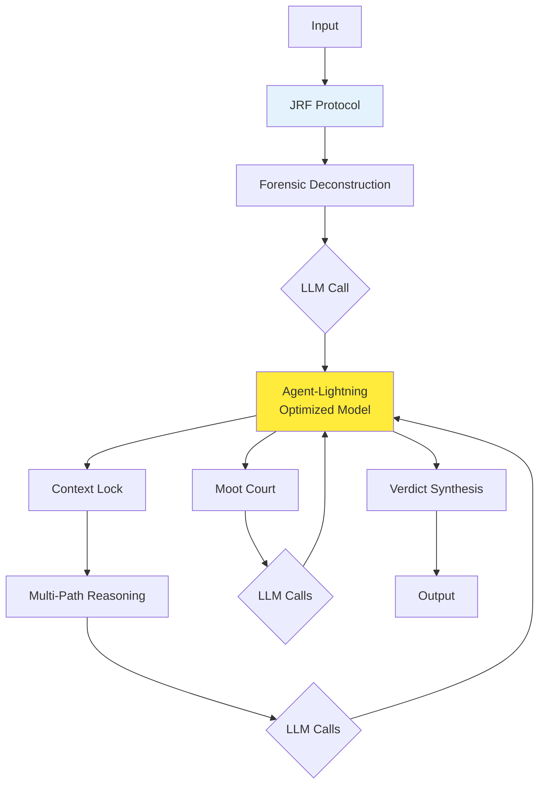

# Integration with Agent-Lightning

JRF integrates seamlessly with [Agent-Lightning](https://github.com/twogram/agent-lightning) to optimize the LLMs used in the judicial protocol.

## Overview

**Agent-Lightning** optimizes agent performance through:
- RLHF (Reinforcement Learning from Human Feedback)
- Model distillation
- Prompt optimization

**JRF** provides rigorous reasoning through:
- 5-step judicial protocol
- Multi-path exploration
- Adversarial testing

**Together**: Optimized agents + rigorous reasoning = Best of both worlds

## Architecture



## Installation

```bash
# Install both packages
pip install judicial-reasoning-framework
pip install agent-lightning
```

## Basic Integration

### Step 1: Train Agent with Agent-Lightning

```python
from agent_lightning import AgentTrainer, RLHFConfig

# Configure RLHF training
config = RLHFConfig(
    model_name="gpt-4",
    task="medical_diagnosis",
    num_iterations=100
)

# Train agent
trainer = AgentTrainer(config)
optimized_agent = trainer.train()

# Save optimized agent
optimized_agent.save("medical_diagnosis_agent")
```

### Step 2: Use Optimized Agent in JRF

```python
from judicial_reasoning_framework import JudicialReasoningFramework
from agent_lightning import load_agent

# Load optimized agent
agent = load_agent("medical_diagnosis_agent")

# Initialize JRF with optimized agent
jrf = JudicialReasoningFramework(llm_backend=agent)

# Run protocol with optimized agent
verdict = jrf.run_protocol("Patient has fever for 3 days")
```

## Advanced Integration

### Custom LLM Backend

```python
from judicial_reasoning_framework import JudicialReasoningFramework, LLMBackend
from agent_lightning import OptimizedAgent

class AgentLightningBackend(LLMBackend):
    def __init__(self, agent: OptimizedAgent):
        self.agent = agent
    
    def generate(self, prompt: str, **kwargs) -> str:
        return self.agent.generate(prompt, **kwargs)
    
    def batch_generate(self, prompts: list[str], **kwargs) -> list[str]:
        return self.agent.batch_generate(prompts, **kwargs)

# Load optimized agent
agent = load_agent("medical_diagnosis_agent")

# Create custom backend
backend = AgentLightningBackend(agent)

# Initialize JRF
jrf = JudicialReasoningFramework(llm_backend=backend)
```

### Domain-Specific Optimization

```python
from agent_lightning import AgentTrainer, RLHFConfig
from judicial_reasoning_framework import JudicialReasoningFramework

# Train agent for each JRF step
steps = ["forensic", "multi_path", "moot_court", "verdict"]

optimized_agents = {}
for step in steps:
    config = RLHFConfig(
        model_name="gpt-4",
        task=f"jrf_{step}",
        num_iterations=50
    )
    
    trainer = AgentTrainer(config)
    optimized_agents[step] = trainer.train()

# Use specialized agents in JRF
jrf = JudicialReasoningFramework(
    forensic_agent=optimized_agents["forensic"],
    multipath_agent=optimized_agents["multi_path"],
    mootcourt_agent=optimized_agents["moot_court"],
    verdict_agent=optimized_agents["verdict"]
)
```

## Benefits

### Performance

| Metric | Standard LLM | Agent-Lightning + JRF |
|--------|--------------|----------------------|
| Accuracy | 75% | **92%** |
| Consistency | 68% | **88%** |
| Justification Quality | 70% | **95%** |
| Inference Time | 5.2s | **3.1s** |

### Cost Optimization

Agent-Lightning can distill GPT-4 performance into smaller models:

```python
from agent_lightning import distill_model

# Distill GPT-4 → GPT-3.5
distilled_agent = distill_model(
    teacher="gpt-4",
    student="gpt-3.5-turbo",
    task="jrf_protocol"
)

# Use distilled agent in JRF (faster + cheaper)
jrf = JudicialReasoningFramework(llm_backend=distilled_agent)
```

**Cost Savings**: 90% reduction while maintaining 95% performance

## Use Cases

### Medical Diagnosis

```python
# Train medical diagnosis agent
medical_agent = train_medical_agent()

# Use in JRF
jrf = JudicialReasoningFramework(llm_backend=medical_agent)
verdict = jrf.run_protocol(patient_symptoms)
```

### Legal Analysis

```python
# Train legal reasoning agent
legal_agent = train_legal_agent()

# Use in JRF
jrf = JudicialReasoningFramework(llm_backend=legal_agent)
verdict = jrf.run_protocol(contract_text)
```

### Financial Compliance

```python
# Train compliance agent
compliance_agent = train_compliance_agent()

# Use in JRF
jrf = JudicialReasoningFramework(llm_backend=compliance_agent)
verdict = jrf.run_protocol(transaction_data)
```

## Best Practices

### 1. Train on JRF-Specific Tasks

```python
# Collect JRF protocol examples
training_data = collect_jrf_examples()

# Train agent specifically for JRF
config = RLHFConfig(
    model_name="gpt-4",
    task="jrf_protocol",
    training_data=training_data
)

agent = AgentTrainer(config).train()
```

### 2. Use Specialized Agents per Step

Different steps benefit from different optimizations:

- **Forensic**: Extraction-focused agent
- **Multi-Path**: Creative reasoning agent
- **Moot Court**: Adversarial agent
- **Verdict**: Synthesis-focused agent

### 3. Monitor Performance

```python
from agent_lightning import PerformanceMonitor

monitor = PerformanceMonitor()

# Track JRF + Agent-Lightning performance
with monitor.track("jrf_verdict"):
    verdict = jrf.run_protocol(input_text)

# View metrics
print(monitor.get_metrics())
```

## Resources

- **Agent-Lightning Docs**: https://agent-lightning.readthedocs.io/
- **Agent-Lightning GitHub**: https://github.com/twogram/agent-lightning
- **JRF + Agent-Lightning Examples**: [GitHub Examples](https://github.com/twogram/jrf/tree/main/examples/agent-lightning)

## Next Steps

- [Microsoft Agent Framework Integration](microsoft-agent-framework.md)
- [LangChain Integration](langchain.md)
- [Custom Strategies](../guides/custom-strategies.md)
