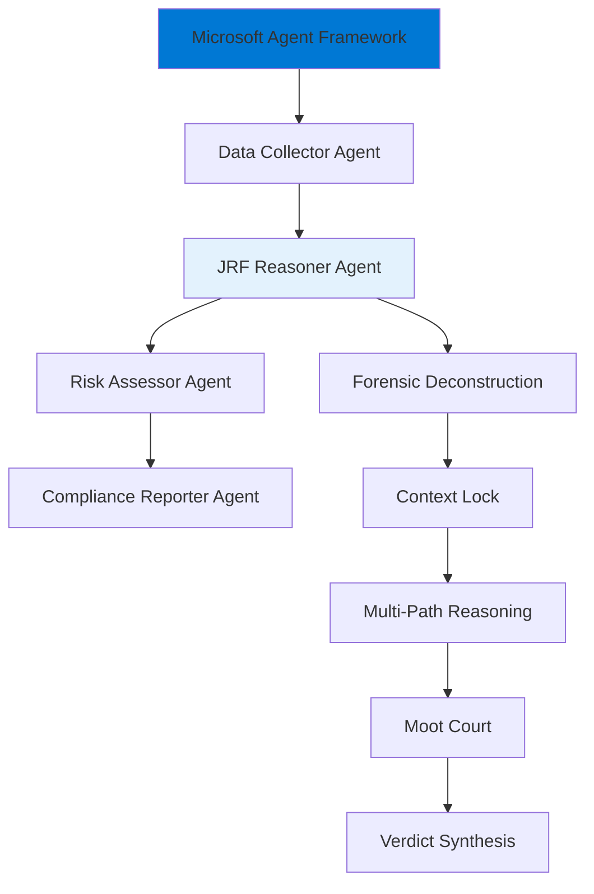

# Integration with Microsoft Agent Framework

JRF integrates with [Microsoft Agent Framework](https://learn.microsoft.com/en-us/agent-framework/overview/agent-framework-overview) as a specialized reasoning executor in multi-agent workflows.

## Overview

**Microsoft Agent Framework** provides:
- Multi-agent orchestration
- Workflow management
- Checkpointing and state management
- Conditional routing

**JRF** provides:
- Rigorous reasoning protocol
- Judicial-grade justification
- Multi-path exploration
- Adversarial testing

**Together**: Orchestrated workflows + rigorous reasoning

## Architecture



## Installation

```bash
# Install both packages
pip install judicial-reasoning-framework
pip install microsoft-agent-framework
```

## Basic Integration

### Step 1: Create JRF Executor

```python
from agent_framework import Executor
from judicial_reasoning_framework import JudicialReasoningFramework

class JRFExecutor(Executor):
    """JRF as an executor in Microsoft Agent Framework"""
    
    def __init__(self):
        super().__init__()
        self.jrf = JudicialReasoningFramework()
    
    def execute(self, input_message):
        """Execute JRF protocol"""
        # Run judicial protocol
        verdict = self.jrf.run_protocol(input_message.content)
        
        # Return verdict as message
        return {
            "conclusion": verdict.conclusion,
            "certainty": verdict.certainty,
            "justification": verdict.justification,
            "recommendations": verdict.recommendations
        }
```

### Step 2: Create Workflow

```python
from agent_framework import Workflow

# Create workflow
workflow = Workflow()

# Add executors
workflow.add_executor("data_collector", DataCollectorExecutor())
workflow.add_executor("jrf_reasoner", JRFExecutor())
workflow.add_executor("risk_assessor", RiskAssessorExecutor())
workflow.add_executor("reporter", ReporterExecutor())

# Define edges (data flow)
workflow.add_edge("data_collector", "jrf_reasoner")
workflow.add_edge("jrf_reasoner", "risk_assessor")
workflow.add_edge("risk_assessor", "reporter")

# Run workflow
result = workflow.run(initial_input="Analyze compliance for transaction XYZ")
```

## Advanced Integration

### Async JRF Executor

JRF is synchronous, but Microsoft Agent Framework supports async. Wrap JRF in async executor:

```python
import asyncio
from agent_framework import Executor

class AsyncJRFExecutor(Executor):
    def __init__(self):
        super().__init__()
        self.jrf = JudicialReasoningFramework()
    
    async def execute(self, input_message):
        """Execute JRF in thread pool"""
        loop = asyncio.get_event_loop()
        
        # Run JRF in thread pool (non-blocking)
        verdict = await loop.run_in_executor(
            None,
            self.jrf.run_protocol,
            input_message.content
        )
        
        return {
            "conclusion": verdict.conclusion,
            "certainty": verdict.certainty,
            "justification": verdict.justification
        }
```

### Conditional Routing

Route based on JRF verdict certainty:

```python
from agent_framework import Workflow, ConditionalEdge

workflow = Workflow()

# Add executors
workflow.add_executor("jrf_reasoner", JRFExecutor())
workflow.add_executor("human_review", HumanReviewExecutor())
workflow.add_executor("auto_approve", AutoApproveExecutor())

# Conditional routing based on certainty
def route_by_certainty(message):
    if message["certainty"] < 0.7:
        return "human_review"  # Low certainty → human review
    else:
        return "auto_approve"  # High certainty → auto-approve

workflow.add_conditional_edge(
    "jrf_reasoner",
    route_by_certainty,
    {
        "human_review": "human_review",
        "auto_approve": "auto_approve"
    }
)
```

### Checkpointing

Save JRF state for long-running workflows:

```python
from agent_framework import Workflow, Checkpointer

class JRFExecutorWithCheckpoint(Executor):
    def __init__(self, checkpointer: Checkpointer):
        super().__init__()
        self.jrf = JudicialReasoningFramework()
        self.checkpointer = checkpointer
    
    def execute(self, input_message):
        # Check for existing checkpoint
        checkpoint = self.checkpointer.load("jrf_verdict")
        if checkpoint:
            return checkpoint
        
        # Run JRF protocol
        verdict = self.jrf.run_protocol(input_message.content)
        
        # Save checkpoint
        result = {
            "conclusion": verdict.conclusion,
            "certainty": verdict.certainty,
            "justification": verdict.justification
        }
        self.checkpointer.save("jrf_verdict", result)
        
        return result
```

## Use Cases

### Legal Compliance Workflow

```python
# Workflow: Document → JRF Analysis → Risk Assessment → Report

workflow = Workflow()

# 1. Collect legal documents
workflow.add_executor("doc_collector", DocumentCollectorExecutor())

# 2. JRF analyzes for compliance
workflow.add_executor("jrf_legal", JRFExecutor())

# 3. Assess risk based on JRF verdict
workflow.add_executor("risk_assessor", RiskAssessorExecutor())

# 4. Generate compliance report
workflow.add_executor("reporter", ComplianceReporterExecutor())

# Connect
workflow.add_edge("doc_collector", "jrf_legal")
workflow.add_edge("jrf_legal", "risk_assessor")
workflow.add_edge("risk_assessor", "reporter")

# Run
result = workflow.run("Analyze contract ABC-123")
```

### Medical Diagnosis Workflow

```python
# Workflow: Symptoms → JRF Diagnosis → Treatment Plan → Prescription

workflow = Workflow()

workflow.add_executor("symptom_collector", SymptomCollectorExecutor())
workflow.add_executor("jrf_diagnosis", JRFExecutor())
workflow.add_executor("treatment_planner", TreatmentPlannerExecutor())
workflow.add_executor("prescription", PrescriptionExecutor())

# Conditional routing: if uncertain → specialist referral
def route_diagnosis(message):
    if message["certainty"] < 0.8:
        return "specialist_referral"
    else:
        return "treatment_planner"

workflow.add_conditional_edge(
    "jrf_diagnosis",
    route_diagnosis,
    {
        "specialist_referral": "specialist_referral",
        "treatment_planner": "treatment_planner"
    }
)

workflow.add_edge("treatment_planner", "prescription")
```

### Financial Fraud Detection

```python
# Workflow: Transactions → JRF Analysis → Alert/Approve

workflow = Workflow()

workflow.add_executor("transaction_monitor", TransactionMonitorExecutor())
workflow.add_executor("jrf_fraud_detector", JRFExecutor())
workflow.add_executor("fraud_alert", FraudAlertExecutor())
workflow.add_executor("auto_approve", AutoApproveExecutor())

# Route based on JRF verdict
def route_fraud_check(message):
    if message["certainty"] > 0.9 and "fraud" in message["conclusion"].lower():
        return "fraud_alert"
    else:
        return "auto_approve"

workflow.add_conditional_edge(
    "jrf_fraud_detector",
    route_fraud_check,
    {
        "fraud_alert": "fraud_alert",
        "auto_approve": "auto_approve"
    }
)
```

## Benefits

### Complementary Strengths

| Microsoft Agent Framework | JRF |
|---------------------------|-----|
| Orchestration | Reasoning |
| State management | Justification |
| Conditional routing | Multi-path exploration |
| Checkpointing | Adversarial testing |
| Async execution | Certainty scoring |

### Combined Value

- **Traceability**: Full audit trail (Framework workflow + JRF protocol)
- **Scalability**: Async execution with rigorous reasoning
- **Flexibility**: Route based on JRF certainty
- **Reliability**: Checkpointing for long-running JRF analyses

## Best Practices

### 1. Use JRF for Critical Decisions

```python
# Use JRF for high-stakes decisions
workflow.add_executor("critical_decision", JRFExecutor())

# Use simpler agents for routine tasks
workflow.add_executor("routine_task", SimpleExecutor())
```

### 2. Route Based on Certainty

```python
# Low certainty → human review
# High certainty → auto-proceed

def route_by_certainty(message):
    if message["certainty"] < 0.7:
        return "human_review"
    elif message["certainty"] < 0.9:
        return "secondary_check"
    else:
        return "auto_approve"
```

### 3. Checkpoint Long-Running Analyses

```python
# Save JRF state for complex analyses
checkpointer = Checkpointer()
jrf_executor = JRFExecutorWithCheckpoint(checkpointer)
```

## Resources

- **Microsoft Agent Framework Docs**: https://learn.microsoft.com/en-us/agent-framework/
- **JRF + MAF Examples**: [GitHub Examples](https://github.com/twogram/jrf/tree/main/examples/microsoft-agent-framework)

## Next Steps

- [Agent-Lightning Integration](agent-lightning.md)
- [LangChain Integration](langchain.md)
- [Custom Strategies](../guides/custom-strategies.md)
